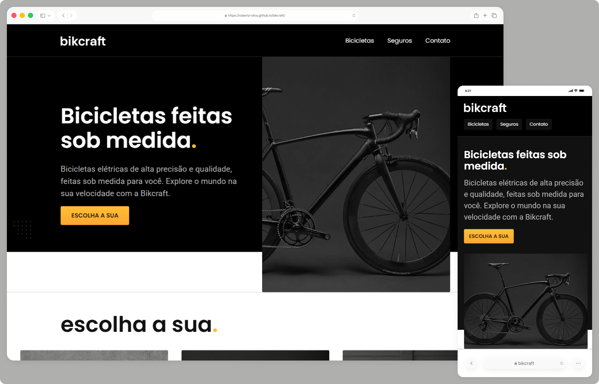

# Bikcraft ✨

Site institucional fictício desenvolvido com foco em HTML e CSS, com o objetivo de praticar a estruturação de páginas web usando HTML semântico e boas práticas.  

> Status do projeto: Concluído ✔️

## Acesse o projeto

🔗 [https://roberta-silva.github.io/bikcraft/](https://roberta-silva.github.io/bikcraft/)

## Funcionalidades
- Estrutura de site institucional com páginas e seções organizadas  
- Desenvolvimento básico de formulário com JavaScript  
- Efeitos e animações usando JavaScript e plugins  
- Organização de conteúdo com listas, links e imagens  

## Objetivos técnicos
- Estruturação do HTML5 com foco em semântica (header, main, section, footer, etc.)  
- Uso de JavaScript para efeitos e animações  
- Implementação de classes utilitárias em CSS  
- Boas práticas de organização e estilização de conteúdo  
- Primeiros testes de hospedagem de site  

## Tecnologias
- HTML5  
- CSS3  
- JavaScript (ES6+)  

## 👀 Preview

